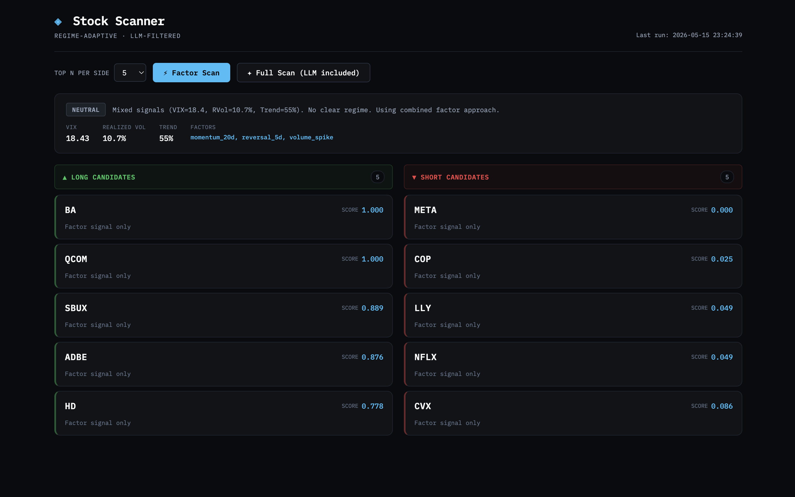

# LLM-Driven Stock Scanner

A daily stock watchlist generator that combines **regime-adaptive factor selection** with **LLM-powered news analysis** to produce actionable trading candidates each morning.

---

## What It Does

Every day, before market open:

1. Detects the current market regime (TRENDING / VOLATILE / NEUTRAL) using VIX, realized volatility, and trend consistency
2. Selects the appropriate factor signals based on the regime — momentum factors in trending markets, reversal factors in volatile markets
3. Scores and ranks 55 S&P 500 stocks cross-sectionally
4. Fetches recent news for the top candidates
5. Uses Claude (Anthropic) to analyze whether news supports or contradicts each factor signal
6. Outputs a ranked watchlist with signal, confidence score, and one-line reason for each stock

---

## Live Demo

| | URL |
|--|--|
| Dashboard | https://llm-driven-stock-scanner.vercel.app |
| API Docs  | https://llm-driven-stock-scanner-production.up.railway.app/docs |



```
Regime  : NEUTRAL
Factors : momentum_20d + reversal_5d + volume_spike
VIX     : 18.4 | Realized Vol: 10.7% | Trend: 55%

LONG CANDIDATES
  ADBE  | BUY     | conf= 72% | Agentic AI expansion supports momentum; Figma competition warrants caution.
  QCOM  | BUY     | conf= 62% | Perfect factor score; rebound thesis intact but ARM competition noted.
  HD    | BUY     | conf= 62% | Strong factor signal; mixed news offset by bargain valuation framing.
  SBUX  | NEUTRAL | conf= 48% | $400M restructuring charge undermines bullish momentum signal.
  BA    | NEUTRAL | conf= 42% | China deal disappointed; share slide contradicts perfect factor score.
           Risk: Geopolitical and order volume uncertainty persist

SHORT CANDIDATES
  LLY   | AVOID   | conf= 62% | Q1 guidance upgrade and obesity trial results contradict short signal.
           Risk: Positive catalysts risk short squeeze
  NFLX  | AVOID   | conf= 38% | Raised guidance and 283% analyst upside directly contradict short.
  COP   | AVOID   | conf= 38% | Energy sector rally contradicts bearish signal.
  META  | NEUTRAL | conf= 42% | No clear short catalyst; Zuckerberg message adds uncertainty.
```

---

## Key Design Decisions

### Why Regime-Adaptive Factors?

Factor effectiveness depends on market environment. Research on historical US equity data shows:

| Period | Regime | Best Factor | Mean IC |
|--------|--------|-------------|---------|
| 2019–2023 | Trending (low VIX) | momentum_20d | +0.030 |
| 2025–2026 | Volatile (tariff shock) | reversal_20d | +0.037 |

Using a fixed factor regardless of regime leaves significant alpha on the table. This scanner detects the regime daily and selects factors accordingly.

### Why LLM for News Analysis?

Factor signals are backward-looking — they capture price and volume patterns from the past 5–60 days. They cannot see upcoming earnings, breaking news, or management guidance changes. LLM news analysis acts as a forward-looking filter.

In the sample output above, BA had the highest factor score (1.0) but the LLM correctly flagged that China trade deal disappointment had already triggered a share slide — overriding the bullish signal.

### Why Not Use LLM for Factor Computation?

Factor computation requires precise arithmetic on large DataFrames. LLMs are unreliable for this. The architecture keeps LLMs where they excel (language understanding, news sentiment) and uses deterministic code where precision matters (factor math, ranking).

---

## Architecture

```
┌─────────────────────────────────────────────────────┐
│                    main.py                          │
│            Orchestrates the full pipeline           │
└──────┬──────────┬──────────┬──────────┬────────────┘
       │          │          │          │
       ▼          ▼          ▼          ▼
  data.py    regime.py  scanner.py  llm_analyst.py
  ────────   ─────────  ──────────  ──────────────
  OHLCV +    Detect      Compute     Fetch news +
  news        market      factor      Claude API
  fetch       regime      scores      analysis
  (yfinance)  (VIX +      (rank +     (few-shot +
              RVol +      combine)    confidence
              trend)                  calibration)
```

### Module Responsibilities

| Module | Role | Uses LLM? |
|--------|------|-----------|
| `data.py` | Download price data and news via yfinance | No |
| `regime.py` | Classify market as TRENDING / VOLATILE / NEUTRAL | No |
| `scanner.py` | Compute factor scores, combine, rank stocks | No |
| `llm_analyst.py` | Analyze news sentiment vs factor signal | Yes |
| `main.py` | Orchestrate pipeline, stability filter, CLI | No |

---

## Regime Detection

Three signals vote independently. Two or more votes determine the regime:

| Signal | VOLATILE vote | TRENDING vote |
|--------|--------------|---------------|
| VIX | ≥ 25 | ≤ 15 |
| Realized Vol (20d) | ≥ 20% annualized | ≤ 12% annualized |
| Trend Consistency (20d) | ≤ 40% days aligned | ≥ 60% days aligned |

A **stability filter** prevents rapid switching: a new regime must persist for 2+ consecutive days before being confirmed.

---

## Factor Library

| Factor | Expression | Best Regime |
|--------|-----------|-------------|
| `reversal_5d` | `-close.diff(5)` | VOLATILE |
| `reversal_20d` | `-close.diff(20)` | VOLATILE |
| `momentum_20d` | `close.pct_change(20)` | TRENDING |
| `momentum_60d` | `close.pct_change(60)` | TRENDING |
| `volume_spike` | `volume / volume.rolling(20).mean()` | NEUTRAL |
| `vol_adjusted_reversal` | `-close.diff(5) / realized_vol_10d` | VOLATILE |

Factors are combined using **cross-sectional percentile ranking** then equal-weight averaging.

---

## LLM Prompt Engineering

`llm_analyst.py` uses several techniques:

**Role prompting** — Claude acts as a quantitative analyst reviewing scanner signals.

**Few-shot examples** — Three examples cover the main scenarios: news supports signal, news contradicts signal, and earnings risk overrides signal.

**Confidence calibration rubric** — Explicit scoring guide prevents confidence clustering:
```
90-100: Hard data directly confirms signal (earnings beat, raised guidance)
75-89 : Clear catalyst present
55-74 : Mixed news, factor signal carries the weight
35-54 : Some contradiction or major uncertainty
15-34 : News clearly contradicts signal
0-14  : Strong negative event overrides everything
```

**Forced JSON output** — Strict format constraint ensures reliable parsing.

**Task decomposition** — Three sub-questions guide each analysis: news alignment, risk event detection, final recommendation.

---

## Project Structure

```
stock-scanner/
├── backend/
│   ├── main.py             # Entry point and pipeline orchestration
│   ├── data.py             # Price data and news fetching
│   ├── regime.py           # Market regime detection
│   ├── scanner.py          # Factor computation and stock ranking
│   ├── llm_analyst.py      # LLM-powered news analysis
│   └── regime_history.json # Regime stability tracking (auto-generated)
├── results/                # Saved watchlists (auto-generated)
│   └── watchlist_YYYYMMDD_HHMMSS.json
└── README.md
```

---

## Setup

**1. Install dependencies**
```bash
pip install anthropic yfinance pandas numpy
```

**2. Set API key**
```bash
export ANTHROPIC_API_KEY="your-key-here"
```

**3. Run**
```bash
# Full pipeline, top 10 per side
python main.py

# Top 5 per side, save results to JSON
python main.py --top 5 --save

# Skip LLM (no API cost, factor scores only)
python main.py --no-llm

# Combine flags
python main.py --top 5 --save --no-llm
```

---

## Limitations and Planned Improvements

**Current limitations:**
- Uses daily (EOD) data — not suitable for intraday execution
- Universe limited to ~55 large-cap S&P 500 stocks
- News from Yahoo Finance only (headlines, not full text)
- Regime thresholds are heuristic, not backtested for optimal values

**Planned improvements:**
- Expand to full S&P 500
- Add intraday data via Polygon.io for day-trading use case
- Implement ReAct-style LLM agent that autonomously decides what data to fetch
- Add earnings calendar integration to automatically flag binary event risk
- Backtest regime thresholds against historical factor IC data
- React frontend dashboard for visual watchlist display

---

## Motivation

Traditional scanners (Finviz, Trade Ideas) apply fixed screening rules regardless of market conditions. This project tests the hypothesis that **combining regime-adaptive quantitative signals with LLM news analysis produces higher-quality watchlists** than either approach alone.

The regime-switching insight comes from empirical factor research on this dataset: momentum factors delivered IC > 0.03 during the 2019–2023 trending market, but turned negative after the April 2025 tariff shock. Reversal factors, which underperformed for years, recovered to IC > 0.037 in 2026. A scanner unaware of this would keep applying momentum signals in a regime where they no longer work.

---

## References

- Kakushadze (2016). *101 Formulaic Alphas*. arXiv:1601.00991
- Liu et al. (2025). *CogAlpha: Cognitive Alpha Mining with LLM-based Multi-Agent Framework*. arXiv:2511.18850
- Yao et al. (2022). *ReAct: Synergizing Reasoning and Acting in Language Models*. arXiv:2210.03629
- [2025 stock market crash](https://en.wikipedia.org/wiki/2025_stock_market_crash)

---

## Author

Jamie Ren · Statistics & Physics (University of Toronto) · M.S. Information Science (Trine University)

*Built as part of quantitative research and AI engineering skill development.*